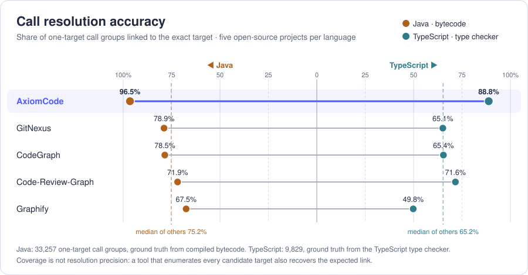

<h1 align="center">AxiomCode Code Graph</h1>

<p align="center">
  <strong>A god's-eye view of your codebase for AI agents. Stop grepping. Ensure correctness and completeness for any task your AI agent performs.</strong>
</p>

<p align="center">
  
  &nbsp;&nbsp;&nbsp;
  
  &nbsp;&nbsp;&nbsp;
  
  &nbsp;&nbsp;&nbsp;
  
  &nbsp;&nbsp;&nbsp;
  
  &nbsp;&nbsp;&nbsp;&nbsp;&nbsp;&nbsp;
  
  &nbsp;&nbsp;
  
  &nbsp;&nbsp;
  
</p>

<p align="center">
  <a href="#what-it-does">What it does</a> ·
  <a href="#why-axiomcode-graph">Why</a> ·
  <a href="#get-started">Get started</a> ·
  <a href="#language-and-skill-maturity">Maturity</a> ·
  <a href="#benchmark-results">Benchmarks</a> ·
  <a href="#cli-commands">CLI</a> ·
  <a href="#graph-output">Graph output</a> ·
  <a href="#measured-cross-file-coverage">Cross-file coverage</a> ·
  <a href="#how-to-run-locally">Run locally</a>
</p>

<p align="center">
  <a href="https://github.com/AxiomCodeAI/axiomcodegraph/actions/workflows/ci.yml"></a>
  <a href="LICENSE.md"></a>
  
</p>

---

## What it does

Give it a repository. It works out, for every function, exactly who calls it and what it calls. Then you or your
AI coding agent can ask **"what breaks if I change this?"** and get the real list, not a guess, including the
callers that never spell the name because they go through an interface, a subclass or a callback.

<p align="center">
  
</p>

The chart above scores every call in five open-source projects per language against the compiler's own answer:
compiled bytecode for Java, the type checker for TypeScript. AxiomCode links **96.5%** of Java calls and **88.8%**
of TypeScript calls to their exact target, more than 17 points ahead of the best CST-based graph builder.
**Across files**, it recovers which files call into which with an F1 of **0.974** in Java and **0.898** in
TypeScript (best CST-based: 0.870 and 0.661), and finds the call path from one method to another
**96.1%** and **87.7%** of the time (78.6% and 65.7%). Full tables in
[Measured cross-file coverage](#measured-cross-file-coverage).

**On real bugs.** 748 held-out Java bugs from [Defects4J](https://github.com/rjust/defects4j), scored once after
the evaluation rules were frozen. A bug counts only when every test that reveals it is selected.

| method | bugs with every triggering test selected | share of the suite selected |
|---|---:|---:|
| **AxiomCode** | **94.9%** | 52.2% |
| GitNexus | 65.2% | 30.8% |
| codegraph | 52.4% | 21.2% |
| Slug-graph | 48.7% | 17.0% |
| string search | 46.8% | 2.8% |
| code-review-graph | 21.9% | 5.4% |

Details in [Benchmark results](#benchmark-results) and [Measured cross-file coverage](#measured-cross-file-coverage).

## Why AxiomCode Graph?

**A typed graph is a more accurate graph.** Most code graphs are built from the concrete syntax tree (CST): they see that a
method named `save` is called and match it to a declaration by name and nearby imports. Wherever the code
dispatches through an interface, an override, a generic or a callback, that match is a guess, and every wrong
guess is a missing or invented edge. AxiomCode resolves each call the way the compiler does, from the declared
and inferred types of the receiver, the class hierarchy and the overload rules, so an edge in the graph is the
call the program actually makes. Because an agent follows these edges several hops deep, one missed link loses
everything beyond it; resolving by type is what keeps a chain of callers, or the tests a change reaches, complete.

AI agents often work with an incomplete picture of a codebase. They spend time piecing together scattered files,
yet can still miss dependencies that lead to incomplete changes and repeated fixes.

AxiomCode Graph makes the structure behind the code queryable. Agents can understand a task's scope, from the
implementation to downstream effects and affected tests, before acting. This supports more reliable changes, more
complete task execution, and up to 50% fewer tool calls to explore a new codebase in our benchmarks.

The graph is grounded in formal methods, using deterministic, language-aware rules. Source locations and confidence
tiers make its results inspectable, while unresolved calls remain explicit rather than being presented as
established relationships.

## Get Started

AxiomCode Graph is two parts. The **engine** (`@axiomcode/code-graph` on npm) parses a repository and builds its
graph; it also provides the `axiomcode` command and an MCP server. The **plugin** (`plugins/axiomcode/`) is the
agent-facing frontend: a skill, seven MCP tools and hooks. Install the engine first.

Requirements: **Node ≥ 22.5** and **`python3`**. Until the prebuilt engine packages are published
([#478](https://github.com/AxiomCodeAI/axiomcodegraph/pull/478)), the first run per language also needs
[Soufflé](https://souffle-lang.github.io) 2.5 (`brew install souffle`) and a C++ compiler.

### Installation

```bash
# 1. the engine and the axiomcode command
npm i -g @axiomcode/code-graph

# 2. the plugin, in your agent
# Claude Code
claude plugin marketplace add AxiomCodeAI/axiomcodegraph && claude plugin install axiomcode@axiomcode
# Codex CLI and desktop app
codex plugin marketplace add AxiomCodeAI/axiomcodegraph && codex plugin add axiomcode@axiomcode
# Copilot CLI (VS Code agent mode loads Copilot CLI's plugins too)
copilot plugin marketplace add AxiomCodeAI/axiomcodegraph && copilot plugin install axiomcode@axiomcode
# Gemini CLI
gemini extensions install https://github.com/AxiomCodeAI/axiomcodegraph
# Cursor
cursor-agent plugin marketplace add https://github.com/AxiomCodeAI/axiomcodegraph
# Windsurf, Devin CLI
devin plugins install AxiomCodeAI/axiomcodegraph#plugins/axiomcode
```

Any other agent that speaks MCP (OpenCode, Amp, Cline, Antigravity, …) takes one entry in its MCP config; see
[Support for agents](#support-for-agents). Start a new agent session afterwards: plugins are loaded at startup.
Add `.axiomcode/` to your `.gitignore`; the graph is built there on first use.

### Uninstallation

```bash
# 1. the plugin, in your agent
# Claude Code
claude plugin uninstall axiomcode@axiomcode && claude plugin marketplace remove axiomcode
# Codex CLI
codex plugin remove axiomcode@axiomcode && codex plugin marketplace remove axiomcode
# Copilot CLI
copilot plugin uninstall axiomcode@axiomcode && copilot plugin marketplace remove axiomcode
# Gemini CLI
gemini extensions uninstall axiomcode

# 2. the engine, and the graphs it built
npm uninstall -g @axiomcode/code-graph
rm -rf <your-project>/.axiomcode ~/.cache/axiomcode
```

In Cursor, remove the plugin from the Plugins panel; in Devin CLI, from its plugin manager; in VS Code, take the
repository out of `chat.plugins.marketplaces`; in any other MCP client, delete the `axiomcode` entry.

### Examples

From the shell, in any Java, TypeScript, Python, JavaScript or C# project. There is no setup step: the first
command builds the graph and later ones read it.

In this TypeScript project, `main` builds an `OrderService` and calls `place`, which writes to two things in two
other folders: a `Ledger`, a concrete class, and a `Store`, an interface that `SqlStore` and `MemoryStore`
implement. Both chains cross files; the second goes through the interface, where nothing in `orderService.ts`
names `SqlStore`, so searching for it never reaches the caller.

```bash
cd <your-project>
axiomcode path main Ledger.put
axiomcode path main SqlStore.put
```

```
main → Ledger.put: 1 of 1 target(s) reached through resolved calls; nearest at 2 hop(s)
  2 call(s):
    main   src/main.ts:6
      → [known_edge · call @ src/main.ts:9] OrderService.place   src/orders/orderService.ts:7
      → [known_edge · call @ src/orders/orderService.ts:8] Ledger.put   src/ledger/ledger.ts:4
  verified: every printed hop is an edge in the graph and a second, independent traversal finds the same length

main → SqlStore.put: 1 of 1 target(s) reached through resolved calls; nearest at 2 hop(s)
  2 call(s):
    main   src/main.ts:6
      → [known_edge · call @ src/main.ts:9] OrderService.place   src/orders/orderService.ts:7
      → [multi_inferred · call @ src/orders/orderService.ts:9] SqlStore.put   src/storage/sqlStore.ts:6
  verified: every printed hop is an edge in the graph and a second, independent traversal finds the same length
  what the hops are:
    [known_edge] resolved to one declaration
    [multi_inferred] several declarations fit; each is a real candidate
```

The first chain is `known_edge` all the way: each call has exactly one target. The second ends in
`multi_inferred`, because `store.put` can run `SqlStore.put` or `MemoryStore.put`, depending on which store `main`
built; the graph keeps both as candidates instead of picking one.

From an agent, ask in plain words. The skill tells the agent to query the graph instead of grepping:

```
> What breaks if I change SqlStore.put?

  axiomcode_impact("SqlStore.put")
  must change with it (1: bound by a contract the engine resolved):
      Store.put   src/storage/store.ts:2   — it implements this
  reads or uses it (3 callable(s): 1 one of a set, 2 alongside):
      [one of a set] OrderService.place   src/orders/orderService.ts:9   — calls it
      ...
  reaches those through resolved calls: 4 more callable(s) in 3 file(s)
      src/main.ts: main → OrderService.place
  tests: 1 of 1 test method(s) reach the change
      test files: test/orderService.test.ts (1)
  verified: 2 printed edge(s) looked up again in the graph, all present
```

The change reaches the entry point and the test through a call that never names `SqlStore`.

Each hop carries the line the call is on, how certain the edge is, and what kind of call it is. Every printed
edge is looked up again in the graph before you see it; the `verified:` line is that check reporting.

### Support for agents

Every agent below gets the seven MCP tools and the skill; the hooks, which add the graph's edges to the agent's
own file reads and searches, run where the last column says so.

| Agent | Install | Uninstall | Hooks |
|---|---|---|---|
| **Claude Code** | `claude plugin marketplace add AxiomCodeAI/axiomcodegraph` then `claude plugin install axiomcode@axiomcode` | `claude plugin uninstall axiomcode@axiomcode` | yes |
| **Codex CLI** and desktop app | `codex plugin marketplace add AxiomCodeAI/axiomcodegraph` then `codex plugin add axiomcode@axiomcode` | `codex plugin remove axiomcode@axiomcode` | yes |
| **Copilot CLI** | `copilot plugin marketplace add AxiomCodeAI/axiomcodegraph` then `copilot plugin install axiomcode@axiomcode` | `copilot plugin uninstall axiomcode@axiomcode` | no |
| **VS Code** (Copilot agent mode) | add `"chat.plugins.marketplaces": ["AxiomCodeAI/axiomcodegraph"]` to settings | remove the setting | no |
| **Cursor** | `cursor-agent plugin marketplace add https://github.com/AxiomCodeAI/axiomcodegraph` | the Plugins panel | yes |
| **Gemini CLI** | `gemini extensions install https://github.com/AxiomCodeAI/axiomcodegraph` | `gemini extensions uninstall axiomcode` | yes |
| **Windsurf**, **Devin CLI** | `devin plugins install AxiomCodeAI/axiomcodegraph#plugins/axiomcode` | Devin's plugin manager | no |
| **Any MCP client** (OpenCode, Amp, Cline, Antigravity, …) | the JSON below in its MCP config | remove the entry | no |

```json
{ "mcpServers": { "axiomcode": { "command": "npx", "args": ["-y", "@axiomcode/code-graph", "mcp"] } } }
```

## Language and skill maturity

A language is usable end to end when both the **parser** (source → relational IR) and the **engine**
(IR → graph) support it. The skill, the MCP tools and the CLI answer from the same graph for every language.

| language | parser | engine | maturity |
|---|---|---|---|
| **Java** | stable | stable | **stable**. Hand-crafted constructs at precision and recall 1.000; Spring/DI wiring and configuration files resolved |
| **TypeScript** | stable | stable | **stable**. Structural typing, overload sets, the module graph, `.d.ts` libraries |
| **Python** | stable | stable | **stable**. MRO, decorators, protocols, dynamic-attribute detection |
| **JavaScript** | stable | beta | **beta**. JSDoc as the type channel, CommonJS and ESM; being scored against the TypeScript compiler |
| **C#** | stable | beta | **beta**. Regression cases, ground truth and a runtime oracle; not yet in the published engine packages |

XML, YAML, `.properties` and `META-INF/services` are part of the Java graph, so a change to a property key or a
wiring declaration has a blast radius into methods. A repository with several languages gets one graph per
language.

## Benchmark results

**Call resolution.** 96.5% of Java calls and 88.8% of TypeScript calls linked to the compiler's exact target;
the chart above and [Measured cross-file coverage](#measured-cross-file-coverage) break this down.

**Test selection.** On 748 held-out bugs from Defects4J, scored once after the evaluation rules were frozen,
the tests AxiomCode selects include every bug-revealing test for **94.9%** of bugs, against **65.2%** for the
best CST-based graph builder, while selecting a median of 0.98× as many tests as Defects4J's own
selection, which it gets by running the suite.

The table is at the [top of this page](#what-it-does).

**Change impact.** On five real commits of a large JVM project (181,355 methods), the direct callers AxiomCode
reports have precision **0.980** against 0.397 for CST-based name matching, at the same recall. An agent asked
about one change had to read 95 of 43,793 methods, and every true direct caller was among them.

## CLI commands

| command | what it does |
|---|---|
| `axiomcode path <A> <B>` | the chain of calls from A to B, hop by hop. `'*'` as one end gives the whole closure |
| `axiomcode impact <target>` | everything that has to be looked at again when a declaration changes, each labelled with how certain it is. `--tests` adds the tests that reach it |
| `axiomcode test-impact` | which tests have to run for the current edit, with the chain that reaches each |
| `axiomcode changed` | which declarations an edit changed, and how (signature, type, body, added, removed). `--impact` adds what that reaches |
| `axiomcode context "<task>"` | where a task's words land in the code, when you have a problem statement and not yet a name |
| `axiomcode graph` | the whole graph as one self-contained HTML page, at `.axiomcode/graph/graph.html` |
| `axiomcode index` | build or rebuild the graph explicitly; `--lang`, `--src` and `--library` narrow it |
| `axiomcode mcp` | serve the graph to an agent as MCP tools over stdio |

A target is written the way it appears in the code: `Owner.method`, `method`, `Type`, `Owner.field`, or
`file.py:123`. It is resolved exactly; a miss lists the nearest names. `changed` and `test-impact` compare the
working tree with the tree the graph was built from; `--range <a>..<b>` compares two commits. The query commands
take `--json`. `axiomcode help <command>` prints one command's usage.

## Graph output

The graph is one SQLite database, `.axiomcode/out/graph.sqlite`, with the **same schema for
every language** and its documentation inside it (`schema_guide`, `schema_queries`, `schema_vocab`). The main
tables are `call_edges` (one row per call site and possible target), `methods`, `types`, `call_sites`,
`field_access`, `type_use`, and `unresolved_sites`, the calls the engine declares it could not resolve.

Every edge has a tier, so a consumer picks its own risk tolerance:

| tier | meaning |
|---|---|
| `known_edge` | exactly one resolved target |
| `multi_inferred` | a sound set of possible targets (virtual dispatch over instantiated subtypes) |
| `boundary_lib` | the target is in a library: named, not expanded |
| `ambiguous_unknown` | the engine could not resolve the site; kept as a row with a NULL target |

Full schema: [`graph/bundle/SCHEMA.md`](graph/bundle/SCHEMA.md).

## Measured cross-file coverage

Scored against the compiler's ground truth on five open-source projects per language. *Call resolution* is the
share of calls with exactly one possible target that the tool links to that target. *File → file* is the F1 of
the cross-file call relation: which files call into which.

**Java** (ground truth: compiled bytecode, 33,257 one-target call groups)

| tool | call resolution | file → file F1 | callers of a method, F1 | path A→B found |
|---|---:|---:|---:|---:|
| **AxiomCode** | **96.5%** | **0.974** | **0.965** | **0.961** |
| GitNexus | 78.9% | 0.870 | 0.853 | 0.786 |
| codegraph | 78.5% | 0.735 | 0.807 | 0.716 |
| code-review-graph | 71.9% | 0.636 | 0.708 | 0.580 |
| Slug-graph | 67.5% | 0.671 | 0.717 | 0.585 |

**TypeScript** (ground truth: the TypeScript type checker, 9,829 one-target call groups)

| tool | call resolution | file → file F1 | callers of a method, F1 | path A→B found |
|---|---:|---:|---:|---:|
| **AxiomCode** | **88.8%** | **0.898** | **0.872** | **0.877** |
| code-review-graph | 71.6% | 0.605 | 0.660 | 0.576 |
| codegraph | 65.4% | 0.661 | 0.663 | 0.657 |
| GitNexus | 65.1% | 0.639 | 0.582 | 0.514 |
| Slug-graph | 49.8% | 0.616 | 0.564 | 0.436 |

Coverage is not resolution precision: a tool that lists every candidate target of a call also recovers the
expected link, so these numbers are read alongside the tier of each edge.

## How to run locally

From a checkout, to develop the parser, the rules or the plugin:

```bash
git clone https://github.com/AxiomCodeAI/axiomcodegraph.git
cd axiomcodegraph && npm install && npm run build   # parser + engine
export AXIOMCODE_ENGINE="$PWD"                      # or npm i -g . to put this checkout on PATH
bin/axiomcode <your-project> ./out                  # source tree in → ./out/<lang>/graph.sqlite
```

```bash
bin/axiomcode test java          # regression suite; --oracle scores against javac/javap ground truth
bin/axiomcode test typescript    # --oracle scores against the TypeScript compiler
bin/axiomcode test python        # --oracle scores against CPython bytecode and tracing
bin/axiomcode test parser        # the parser's own suites
bin/axiomcode test               # everything
```

Each suite parses its cases, solves them, checks that no call site was dropped, and diffs the edges against a
golden; `--bless` regenerates the goldens. Editing rules needs [Soufflé](https://souffle-lang.github.io) 2.5
locally (the pinned version is in `graph/pipeline/engine.conf`); the engine recompiles on the first solve after a
rule change. After editing the skill or `AGENTS.md`, run `python3 packaging/copies.py`; `python3 tests/manifests.py`
fails while a copy is stale.

## License

[Functional Source License 1.1, Apache 2.0 Future License](LICENSE.md) (FSL-1.1-Apache-2.0). Copyright 2026, AxiomCode Inc.
