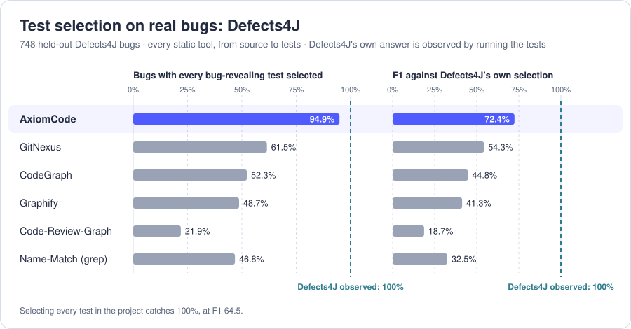
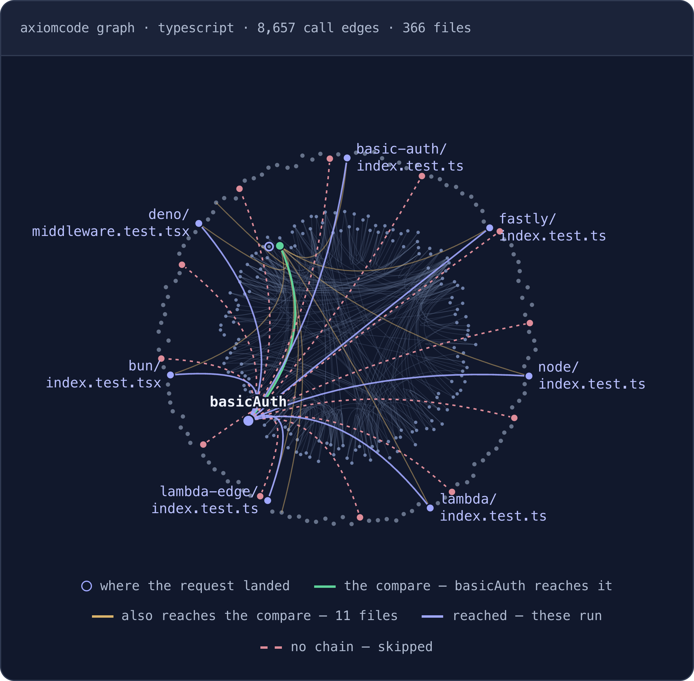
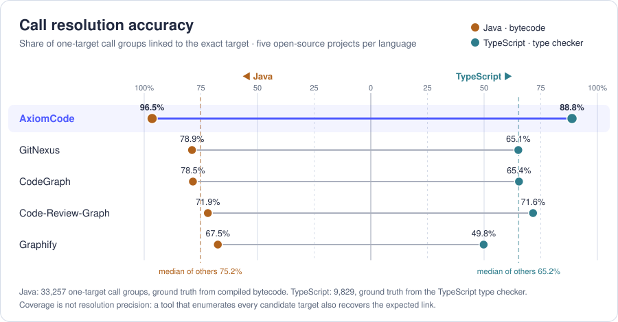

<p align="center">
  
</p>

<h1 align="center">AxiomCode Graph</h1>

<p align="center">
  <strong>A god's-eye view of your codebase for AI agents. Stop grepping. Ensure correctness and completeness for any task your AI agent performs.</strong>
</p>

<p align="center">
  
  &nbsp;&nbsp;&nbsp;
  
  &nbsp;&nbsp;&nbsp;
  
  &nbsp;&nbsp;&nbsp;
  
  &nbsp;&nbsp;&nbsp;
  
  &nbsp;&nbsp;&nbsp;&nbsp;&nbsp;&nbsp;
  
  &nbsp;&nbsp;
  
  &nbsp;&nbsp;
  
</p>

<p align="center">
  <a href="#what-it-does">What it does</a> ·
  <a href="#why-axiomcode-graph">Why</a> ·
  <a href="#get-started">Get started</a> ·
  <a href="#language-and-skill-maturity">Maturity</a> ·
  <a href="#benchmark-results">Benchmarks</a> ·
  <a href="#cli-commands">CLI</a> ·
  <a href="#graph-output">Graph output</a> ·
  <a href="#measured-cross-file-coverage">Cross-file coverage</a> ·
  <a href="#how-to-run-locally">Run locally</a>
</p>

<p align="center">
  <a href="https://github.com/AxiomCodeAI/axiomcodegraph/actions/workflows/ci.yml"></a>
  <a href="https://www.npmjs.com/package/@axiomcode/code-graph"></a>
  <a href="https://github.com/AxiomCodeAI/axiomcodegraph/actions/workflows/nightly.yml"></a>
  <a href="LICENSE.md"></a>
  
</p>

<p align="center">
  <b>Be first to see what we build.</b> &nbsp;<a href="https://axiomcode.ai/updates"><b>Stay in touch ↗</b></a>
</p>

---

## What it does

Give it a repository. It builds a knowledge graph of your code using formal methods: for every function, exactly
who calls it and what it calls, derived by logical rules rather than guessed. Your AI agents, and you, then
understand, explore, search and edit the code from that map instead of grepping. Grep cannot see calls through an
interface, a subclass or a callback, and its output gets truncated, so agents silently miss what was cut. The map
prunes 99.9% of the codebase, so agents keep their context for the task, not the search.

<p align="center">
  
</p>

**On real bugs.** On 748 held-out [Defects4J](https://github.com/rjust/defects4j) bugs, scored once after the rules
were frozen, the tests AxiomCode picks from source include every bug-revealing test for **94.9%** of bugs (best
tree-sitter builder: 61.5%), at an **F1 of 72.4** against what Defects4J observes by running the suite.

**Why: types make a better graph.** Choosing tests means following calls several hops back from a change, and one
wrong link loses every test beyond it. A tree-sitter based CST builder matches a call to a declaration by name;
AxiomCode resolves it the way the compiler does, from the receiver's type. Scored against the compiler's own answer,
compiled bytecode for Java and the type checker for TypeScript, over five open-source projects per language:

| share of calls linked to their exact target | **AxiomCode** | GitNexus | CodeGraph | Code-Review-Graph | Graphify |
|---|---:|---:|---:|---:|---:|
| Java, 33,257 calls (bytecode) | **96.5%** | 78.9% | 78.5% | 71.9% | 67.5% |
| TypeScript, 9,829 calls (type checker) | **88.8%** | 65.1% | 65.4% | 71.6% | 49.8% |

**Across files**, it recovers which files call into which with an F1 of **0.976** in Java and **0.896** in
TypeScript (best CST-based: 0.876 and 0.708), and finds the call path from one method to another **97.4%** and
**87.7%** of the time (80.6% and 65.8%).

AxiomCode supports **Java, TypeScript and Python**, with **JavaScript and C#** in beta
([Language and skill maturity](#language-and-skill-maturity)). These benchmarks are Java and TypeScript, the
languages where a compiler gives an independent ground truth to score against. Details in
[Benchmark results](#benchmark-results) and [Measured cross-file coverage](#measured-cross-file-coverage).

## Why AxiomCode Graph?

**A typed graph is a more accurate graph.** Compared with a tree-sitter-based graph builder, which guesses a call's
target from syntax (the name, the imports, a variable's declared type), AxiomCode resolves each call from the
receiver's declared and inferred type, as the compiler does. Through an interface, an override, a generic, or a
callback, syntax alone cannot decide the target, and every wrong guess is a missing or invented edge; a resolved
edge is a call the program actually makes.
That matters because an agent follows edges several hops deep, and one missed link loses everything beyond it.

<p align="center">
  
</p>

*The call graph of an open-source TypeScript web framework, drawn as a page and asked which tests a change to `basicAuth` can
affect. Source files form the inner ring and test files the outer one. The solid blue paths are chains of resolved
calls from `basicAuth` to the 7 test files that must run; the dashed red ones mark the other 130, which have no
chain to it and can be skipped. Green is the shared `compare` that `basicAuth` calls, and gold the 11 other files
that also reach it.*

AI agents work from an incomplete picture of a codebase, and the reason is structural: what a call reaches is
usually decided somewhere else. The type comes from another file, the implementation from another module, the
binding from a dependency or a configuration key. Reading the file in front of you cannot show any of that, so a
missed dependency becomes an incomplete change and a second fix.

AxiomCode Graph makes the structure behind the code queryable. Agents can understand a task's scope, from the
implementation to downstream effects and affected tests, before acting. This supports more reliable changes, more
complete task execution, and up to 50% fewer tool calls to explore a new codebase in our benchmarks.

The graph is grounded in formal methods, using deterministic, language-aware rules. Source locations and confidence
tiers make its results inspectable, while unresolved calls remain explicit rather than being presented as
established relationships that could lead to false positives.

## Get Started

AxiomCode Graph is two parts. The **engine** (`@axiomcode/code-graph` on npm) parses a repository and builds its
graph; it also provides the `axiomcode` command and an MCP server. The **plugin** (`plugins/axiomcode/`) is the
agent-facing frontend: a skill, four MCP tools, and hooks. Install the engine first.

Requirements: **Node ≥ 22.13** and **Python 3** (`python3`, or `python` / `py` on Windows). On Windows, also
[Git for Windows](https://git-scm.com/download/win): the CLI runs under its bash. The engine ships as a prebuilt
binary for macOS (Apple Silicon and Intel), Linux (x64 and arm64) and Windows x64, and `npm install` takes the one for
your platform. No Soufflé and no compiler are needed, with one exception:

> **Linux arm64** (Graviton or Ampere servers, Raspberry Pi, `node:*-slim` or Alpine containers on an Apple Silicon
> Mac): the parser's native modules compile during `npm install`, so install build tools first, e.g.
> `sudo apt install build-essential python3`. The full `node:*` Docker images already include them.

Before every release, the exact packages that ship are installed without Soufflé and run end to end (every CLI verb,
five languages) on macOS arm64 and x64, Linux x64 and arm64, and Windows x64. Check an install with
`axiomcode --version`.

### Installation

```bash
# 1. the engine and the axiomcode command
npm i -g @axiomcode/code-graph

# 2. the plugin, in your agent
# Claude Code
claude plugin marketplace add AxiomCodeAI/axiomcodegraph && claude plugin install axiomcode@axiomcode
# Codex CLI and desktop app
codex plugin marketplace add AxiomCodeAI/axiomcodegraph && codex plugin add axiomcode@axiomcode
# Copilot CLI (VS Code agent mode loads Copilot CLI's plugins too)
copilot plugin marketplace add AxiomCodeAI/axiomcodegraph && copilot plugin install axiomcode@axiomcode
# Gemini CLI
gemini extensions install https://github.com/AxiomCodeAI/axiomcodegraph
# Cursor
cursor-agent plugin marketplace add https://github.com/AxiomCodeAI/axiomcodegraph
# Windsurf, Devin CLI
devin plugins install AxiomCodeAI/axiomcodegraph#plugins/axiomcode
```

Any other agent that speaks MCP takes one entry in its MCP config; see
[Support for agents](#support-for-agents). Start a new agent session afterward: plugins are loaded at startup.
Add `.axiomcode/` to your `.gitignore`; the graph is built there on first use.

### Uninstallation

```bash
# 1. the plugin, in your agent
# Claude Code
claude plugin uninstall axiomcode@axiomcode && claude plugin marketplace remove axiomcode
# Codex CLI
codex plugin remove axiomcode@axiomcode && codex plugin marketplace remove axiomcode
# Copilot CLI
copilot plugin uninstall axiomcode@axiomcode && copilot plugin marketplace remove axiomcode
# Gemini CLI
gemini extensions uninstall axiomcode

# 2. the engine, and the graphs it built
npm uninstall -g @axiomcode/code-graph
rm -rf <your-project>/.axiomcode ~/.cache/axiomcode
```

In Cursor, remove the plugin from the Plugins panel; in Devin CLI, from its plugin manager; in VS Code, take the
repository out of `chat.plugins.marketplaces`; in any other MCP client, delete the `axiomcode` entry.

### Examples

From the shell, in any Java, TypeScript, Python, JavaScript, or C# project. There is no setup step: the first
command builds the graph, and later ones read it.

In this TypeScript project, `main` builds an `OrderService` and calls `place`, which writes to two things in two
other folders: a `Ledger`, a concrete class, and a `Store`, an interface that `SqlStore` and `MemoryStore`
implement. Both chains cross files; the second goes through the interface, where nothing in `orderService.ts`
names `SqlStore`, so searching for it never reaches the caller.

```bash
cd <your-project>
axiomcode path main Ledger.put
axiomcode path main SqlStore.put
```

Every answer is a numbered list of places, each with the code of the function it sits in and the line that matters
marked `→`:

````
1. src/main.ts:9  [resolved · hop 1/2 main → OrderService.place]
   ```typescript
      6  export function main(useSql: boolean): void {
      7    const store = useSql ? new SqlStore("orders") : new MemoryStore();
      8    const service = new OrderService(new Ledger(), store);
   →  9    service.place("A-1", 42);
     10  }
   ```
2. src/orders/orderService.ts:8  [resolved · hop 2/2 OrderService.place → Ledger.put]
   ```typescript
      7    place(id: string, amount: number): void {
   →  8      this.ledger.put(`order ${id}: ${amount}`);
      9      this.store.put(id, amount);
     10    }
   ```
verified: ✓ (2 edge(s) looked up again)
````

The second chain ends the same way, at `src/orders/orderService.ts:9`, tagged `one of a set`: `store.put` can run
`SqlStore.put` or `MemoryStore.put`, depending on which store `main` built, and the graph keeps both as candidates
instead of picking one.

From an agent, ask in plain words. The skill tells the agent to query the graph instead of grepping:

````
> What breaks if I change SqlStore.put?

  impact("SqlStore.put")
  1. src/storage/store.ts:2  [must change · it implements this]
     ```typescript
     → 2    put(key: string, value: number): void;
     ```
  2. src/orders/orderService.ts:9  [one of a set · OrderService.place]
     ```typescript
        7    place(id: string, amount: number): void {
        8      this.ledger.put(`order ${id}: ${amount}`);
     →  9      this.store.put(id, amount);
       10    }
     ```
  3. src/main.ts:6  [hop 2]
     ...
  4. test/orderService.test.ts:3  [test · one of a set · hop 3]
     ...
  verified: ✓ (3 edge(s) looked up again)
````

The change reaches the entry point and the test through a call that never names `SqlStore`. Every printed edge is
looked up again in the graph before you see it; the `verified:` line is that check reporting.

### Support for agents

Every agent below gets the four MCP tools and the skill; the hooks, which keep the graph current and report what an
edit breaks, run where the last column says so. No hook annotates the agent's own reads and searches.

| Agent | Install | Uninstall | Hooks |
|---|---|---|---|
| **Claude Code** | `claude plugin marketplace add AxiomCodeAI/axiomcodegraph` then `claude plugin install axiomcode@axiomcode` | `claude plugin uninstall axiomcode@axiomcode` | yes |
| **Codex CLI** and desktop app | `codex plugin marketplace add AxiomCodeAI/axiomcodegraph` then `codex plugin add axiomcode@axiomcode` | `codex plugin remove axiomcode@axiomcode` | yes |
| **Copilot CLI** | `copilot plugin marketplace add AxiomCodeAI/axiomcodegraph` then `copilot plugin install axiomcode@axiomcode` | `copilot plugin uninstall axiomcode@axiomcode` | no |
| **VS Code** (Copilot agent mode) | add `"chat.plugins.marketplaces": ["AxiomCodeAI/axiomcodegraph"]` to settings | remove the setting | no |
| **Cursor** | `cursor-agent plugin marketplace add https://github.com/AxiomCodeAI/axiomcodegraph` | the Plugins panel | yes |
| **Gemini CLI** | `gemini extensions install https://github.com/AxiomCodeAI/axiomcodegraph` | `gemini extensions uninstall axiomcode` | yes |
| **Windsurf**, **Devin CLI** | `devin plugins install AxiomCodeAI/axiomcodegraph#plugins/axiomcode` | Devin's plugin manager | no |
| **Any MCP client** and others | the JSON below in its MCP config | remove the entry | no |

```json
{ "mcpServers": { "axiomcode": { "command": "npx", "args": ["-y", "@axiomcode/code-graph", "mcp"] } } }
```

## Language and skill maturity

A language is usable end to end when both the **parser** (source → relational IR) and the **engine**
(IR → graph) support it. The skill, the MCP tools and the CLI answer from the same graph for every language.

| language | parser | engine | maturity |
|---|---|---|---|
| **Java** | stable | stable | **stable**. Hand-crafted constructs at precision and recall 1.000; Spring/DI wiring and configuration files resolved |
| **TypeScript** | stable | stable | **stable**. Structural typing, overload sets, the module graph, `.d.ts` libraries |
| **Python** | stable | stable | **stable**. MRO, decorators, protocols, dynamic-attribute detection |
| **JavaScript** | stable | beta | **beta**. JSDoc as the type channel, CommonJS and ESM; being scored against the TypeScript compiler |
| **C#** | stable | beta | **beta**. Regression cases, ground truth and a runtime oracle |

XML, YAML, `.properties` and `META-INF/services` are part of the Java graph, so a change to a property key or a
wiring declaration has a blast radius into methods. A repository with several languages gets one graph per
language.

## Benchmark results

**Call resolution.** 96.5% of Java calls and 88.8% of TypeScript calls linked to the compiler's exact target;
the chart above and [Measured cross-file coverage](#measured-cross-file-coverage) break this down.

**Test selection.** On 748 held-out bugs from Defects4J, scored once after the evaluation rules were frozen,
the tests AxiomCode selects include every bug-revealing test for **94.9%** of bugs, against **61.5%** for the
best CST-based graph builder, at an F1 of **72.4** against Defects4J's own selection, which it gets by
running the suite.

The table is at the [top of this page](#what-it-does).

**Change impact.** On five real commits of a large JVM project (181,355 methods), the direct callers AxiomCode
reports have precision **0.980** against 0.397 for CST-based name matching, at the same recall. An agent asked
about one change had to read 95 of 43,793 methods, and every true direct caller was among them.

## CLI commands

Three questions, each answered as numbered places with the code of the function each one sits in. The MCP server
offers the same three as tools: `impact(name)`, `path(start, end)` and `tests()`. Finding where code lives is
left to your own search: bring the name you found to these commands.

| command | what it answers |
|---|---|
| `axiomcode impact <name>` | who calls it, what a change to it reaches, and the tests that exercise it |
| `axiomcode impact` | the same for the declarations your uncommitted edits changed; the answer starts with `your edits:` |
| `axiomcode path <A> <B>` | how A reaches B: every hop of the call chain, with the code at each call |
| `axiomcode tests` | the tests your uncommitted edits reach, and a last `run:` line with the command that runs them |
| `axiomcode link <file:line> <target>` | record where a call the graph could not resolve lands (kept in `axiomcode-links.tsv`); impact, path and tests then walk it, labelled `[asserted]`. Alone, lists the links and whether each was applied |
| `axiomcode index` | build the graph explicitly (the first query builds it too); `--lang`, `--src` and `--library` narrow it |

A name is written the way it appears in the code: `Owner.method`, `method`, `Type`, `Owner.field`, or
`file.py:123`. It is resolved exactly; a miss lists the nearest names. `axiomcode help <command>` prints one
command's usage.

> [!NOTE]
> `impact` with no name and `tests` compare the working tree with a **baseline**: the last commit (right after an
> explicit `axiomcode index`, the tree it indexed). The background refresh (below) resets it whenever HEAD moves (a
> commit, a merge, a pull, a checkout), so committed edits drop out and nothing accumulates. While edits are
> uncommitted, they read the baseline's own graph, kept in `.axiomcode/base`, so a removed method still shows all its
> callers.

The graph stays current on its own. Every file the parser reads is recorded with its hash at build time; after an
edit, a shell command, a finished turn, at session start, and before a query, anything that differs starts one
background rebuild per repository, with the language, `--src` and `--library` of the graph it replaces. Every
command keeps reading the previous graph until the new one is indexed and swapped in. A query answers from the
previous graph at once, with a `graph refresh:` line naming the files it predates and the rows in them marked;
`--fresh` waits for the rebuild instead, and `AXIOMCODE_FRESH_WAIT` (seconds, default 0) lets every query wait that long. The MCP server also checks every repository it has answered for once 15 minutes have
passed since its last update (`AXIOMCODE_REFRESH_INTERVAL`, seconds; 0 turns it off), which catches edits made while
a session sits idle. The graph records when and why it was built in `index_meta` (`refreshed_at`, `refresh_reason`).
`AXIOMCODE_NO_REFRESH=1` turns the rebuilds off, not the check: an answer from a graph older than an edit still
ends with a `graph refresh: OFF` line naming the files it predates. When a name asked about finds nothing and an
edit since the graph was built writes that name, the line says so, since the declaration may simply be too new
for the graph. A query that does start a rebuild says so on its answer's first line, with the reason. The
hooks and the MCP server's timer never rebuild a graph another axiomcode built (another engine, other rules or another
`IMPACT_VERSION` in its build stamp); a hook says so once per session. The log is `.axiomcode/refresh.log`.

## Graph output

The graph is one SQLite database, `.axiomcode/out/graph.sqlite`, with the **same schema for
every language** and its documentation inside it (`schema_guide`, `schema_queries`, `schema_vocab`). The main
tables are `call_edges` (one row per call site and possible target), `methods`, `types`, `call_sites`,
`field_access`, `type_use`, and `unresolved_sites`, the calls the engine declares it could not resolve.

Every edge has a tier, so a consumer picks its own risk tolerance:

| tier | meaning |
|---|---|
| `known_edge` | exactly one resolved target |
| `multi_inferred` | a sound set of possible targets (virtual dispatch over instantiated subtypes) |
| `boundary_lib` | the target is in a library: named, not expanded |
| `ambiguous_unknown` | the engine could not resolve the site; kept as a row with a NULL target |

Full schema: [`graph/bundle/SCHEMA.md`](graph/bundle/SCHEMA.md).

## Measured cross-file coverage

<p align="center">
  
</p>


Scored against the compiler's ground truth on five open-source projects per language. *Call resolution* is the
share of calls with exactly one possible target that the tool links to that target. *File → file* is the F1 of
the cross-file call relation: which files call into which.

**Java** (ground truth: compiled bytecode, 33,257 one-target call groups)

| tool | call resolution | file → file F1 | callers of a method, F1 | path A→B found |
|---|---:|---:|---:|---:|
| **AxiomCode** | **96.5%** | **0.976** | **0.967** | **0.974** |
| GitNexus | 78.9% | 0.876 | 0.858 | 0.806 |
| CodeGraph | 78.5% | 0.737 | 0.814 | 0.722 |
| Code-Review-Graph | 71.9% | 0.650 | 0.712 | 0.589 |
| Graphify | 67.5% | 0.671 | 0.717 | 0.585 |

**TypeScript** (ground truth: the TypeScript type checker, 9,829 one-target call groups)

| tool | call resolution | file → file F1 | callers of a method, F1 | path A→B found |
|---|---:|---:|---:|---:|
| **AxiomCode** | **88.8%** | **0.896** | **0.873** | **0.877** |
| Code-Review-Graph | 71.6% | 0.708 | 0.749 | 0.654 |
| CodeGraph | 65.4% | 0.663 | 0.667 | 0.658 |
| GitNexus | 65.1% | 0.685 | 0.616 | 0.565 |
| Graphify | 49.8% | 0.616 | 0.564 | 0.436 |

Coverage is not resolution precision: a tool that lists every candidate target of a call also recovers the
expected link, so read these numbers alongside each edge's tier.

## How to run locally

From a checkout, to develop the parser, the rules, or the plugin:

```bash
git clone https://github.com/AxiomCodeAI/axiomcodegraph.git
cd axiomcodegraph && npm install && npm run build   # parser + engine
export AXIOMCODE_ENGINE="$PWD"                      # or npm i -g . to put this checkout on PATH
bin/axiomcode <your-project> ./out                  # source tree in → ./out/<lang>/graph.sqlite
```

```bash
bin/axiomcode test java          # regression suite; --oracle scores against javac/javap ground truth
bin/axiomcode test typescript    # --oracle scores against the TypeScript compiler
bin/axiomcode test python        # --oracle scores against CPython bytecode and tracing
bin/axiomcode test parser        # the parser's own suites
bin/axiomcode test               # everything
```

Each suite parses its cases, solves them, checks that no call site was dropped, and diffs the edges against a
golden; `--bless` regenerates the goldens. Editing rules needs [Soufflé](https://souffle-lang.github.io) 2.5
locally (the pinned version is in `graph/pipeline/engine.conf`); the engine recompiles on the first solve after a
rule change. After editing the skill or `AGENTS.md`, run `python3 packaging/copies.py`; `python3 tests/manifests.py`
fails while a copy is stale.

## License

[Functional Source License 1.1, Apache 2.0 Future License](LICENSE.md) (FSL-1.1-Apache-2.0). Copyright 2026, AxiomCode Inc.
