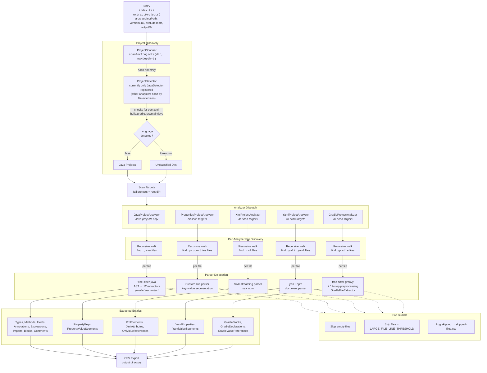

# AxiomCode Parser

A TypeScript-based static code parser/extractor. It parses source code and configuration files to produce structured, relational fact data (CSV) that the AxiomCode reasoning engine consumes downstream.

It has no standalone CLI. It's consumed two ways:

1. **Library API** — `extractProject()` (from `src/extract.ts`).
2. **Positional entry** — `dist/index.js`, for invocation as a subprocess.

## Overview

The parser extracts detailed structural and semantic information from a codebase. The primary focus is **Java**, with additional support for **XML**, **Properties**, **YAML**, and **Gradle** files common in Java ecosystems.

### Supported Languages and File Types

| Language/Format | Maturity | Extracted Entities | Notes |
|-----------------|----------|--------------------|-------|
| **Java** | Stable | Types, methods, fields, annotations, expressions, imports, local variables, blocks, comments | tree-sitter-java with 12 specialized extractors; covers classes, interfaces, enums, records, annotations, generics, and nested types. Expression trees capture method calls, field accesses, and object creation with full depth tracking. Control flow blocks (if, for, try/catch, switch) are extracted with conditions and nesting |
| **XML** | Stable | Elements, attributes, value references | SAX-based streaming parser (`sax` npm); full element hierarchy with XPath, namespace resolution, depth tracking. Detects property placeholders (`${...}`), SpEL (`#{...}`), and placeholders with defaults |
| **Properties** | Stable | Key-value pairs, value segments | Custom line-by-line parser; supports `=`, `:`, and whitespace delimiters, multi-line continuations with `\`, and comment lines (`#`, `!`). Values decomposed into typed segments |
| **YAML** | Beta | Configuration entries, nested structures, value segments | `yaml` npm package; anchor/alias tracking, multi-document support, value type classification |
| **Gradle** | Alpha | Blocks, declarations, value references | tree-sitter-groovy with extensive preprocessing; primarily dependency/version extraction |

### Relationship Model

Extracted data captures **hierarchical and referential relationships** across code elements:

- **Type Hierarchy** — classes reference parent classes, implemented interfaces, and type parameters
- **Member Ownership** — methods, fields, and annotations link to their declaring types via unique hashes
- **Expression Trees** — complex expressions maintain parent-child relationships with depth tracking
- **Cross-File References** — type references link usages to declarations across the codebase
- **Configuration Binding** — XML and Properties files can be correlated with Java code via shared identifiers

All entities share a common `serviceVersionHash` (the `versionLink`), enabling analysis across versioned snapshots of a codebase.

## Features

- **Multi-project analysis** — scans and analyzes multiple Java projects within a directory tree
- **AST-based parsing** — tree-sitter for accurate, language-aware syntax trees
- **Comprehensive extraction** — types, generics, annotations, methods, fields, expressions, references
- **Relational data model** — all entities linked via unique hashes, enabling graph-based queries
- **CSV export** — structured tabular output for databases, BI tools, or custom analysis pipelines
- **Parallel processing** — analyzes languages/projects concurrently
- **Extensible architecture** — plugin-style design for adding new languages and extractors

## Usage

Build first (also runs automatically on `npm install` via the `prepare` hook):

```bash
npm install
```

As a library:

```ts
import { extractProject } from '@axiomcode/parser';

await extractProject({
  projectPath: '/path/to/repo',
  versionLink: '<commit-or-tag>',   // stamped onto every fact
  excludeTests: false,
  outputDir: '/path/to/analysis-results',
});
```

Or via the positional entry (how the orchestrator invokes it):

```bash
node dist/index.js <projectsDir> <serviceVersionLink> <excludeTests:true|false> [outputDir]
```

Both call the same `extractProject()` core in `src/extract.ts`.

## Project Structure

```
src/
├── extract.ts               # Shared extraction core (public API)
├── index.ts                 # Legacy positional entry (orchestrator contract)
├── analysis-types/          # Data models for extracted entities (java/gradle/xml/yaml/properties)
├── analysis-imports/        # Import tracking (Java)
├── analysis-methods/        # Method tracking (Java)
├── constants/               # Application constants and CSV filename mappings
├── enums/                   # Type-safe categorical values (per language)
├── interfaces/              # Shared TypeScript interfaces (BaseExtractor)
├── language-detectors/      # Project language and build-system detection
├── parsers/                 # Language-specific parsers and extractors
│   ├── java/                #   tree-sitter-java AST parser + 12 extractors
│   ├── gradle/              #   tree-sitter-groovy parser + file extractor
│   ├── xml/                 #   SAX-based XML parser
│   ├── yaml/                #   yaml (npm) based parser
│   └── properties/          #   Custom key-value parser
├── types/                   # General type definitions
├── utils/                   # Shared utilities (hashing, project scanning, retry, tree-sitter helpers)
└── workflows/               # Per-language analysis orchestration
```

> The JDK base entities and the generated `analysis-results/` are **not** part of this repo —
> the oracle lives in the JDK-oracle data set, and `analysis-results/` is per-run output.

## Output

The parser writes tab-separated CSV to the output directory (`--out` / `outputDir`):

**Java**

- `all-types.csv`
- `all-type-parameters.csv`
- `all-type-references.csv`
- `all-annotations.csv`
- `all-annotation-arguments.csv`
- `all-methods.csv`
- `all-method-parameters.csv`
- `all-method-type-parameters.csv`
- `all-fields.csv`
- `all-imports.csv`
- `all-expressions.csv`
- `all-local-variables.csv`
- `all-blocks.csv`
- `all-comments.csv`
- `all-enum-constants.csv`
- `all-enum-constant-arguments.csv`

**XML**

- `all-xml-elements.csv`
- `all-xml-attributes.csv`
- `all-xml-value-references.csv`

**Properties**

- `all-property-keys.csv`
- `all-property-value-segments.csv`

**YAML**

- `all-yaml-properties.csv`
- `all-yaml-value-segments.csv`

**Gradle**

- `all-gradle-blocks.csv`
- `all-gradle-declarations.csv`
- `all-gradle-value-references.csv`

**Other**

- `skipped-files.csv` — files that failed to parse, with reasons

## Technology Stack

- **TypeScript** — type-safe development
- **tree-sitter** — AST parsing for Java (`tree-sitter-java`) and Gradle (`tree-sitter-groovy`)
- **sax** — streaming XML parser (pure JS, no native bindings)
- **yaml** — YAML document parser with anchor/alias support
- **Node.js** — runtime

## Development

```bash
npm run build        # tsc && tsc-alias → dist/
npm run typecheck    # tsc --noEmit
npm test             # vitest
```

## Architecture

Layered pipeline:

1. **Detection Layer** (`language-detectors/`) — identifies project languages and build systems
2. **Parsing Layer** (`parsers/`) — language-specific parsers (tree-sitter, SAX, custom)
3. **Extraction Layer** (`parsers/*/extractors/`) — extracts structured metadata from parsed trees
4. **Model Layer** (`analysis-types/`) — typed data models per language with builder pattern + unique hashing
5. **Enum Layer** (`enums/`) — type-safe categorical values per language
6. **Workflow Layer** (`workflows/`) — per-language orchestration: discover files, run extractors, export CSV
7. **Export Layer** — writes tab-separated CSV with headers to the output directory

### Parser Workload Scheduling


